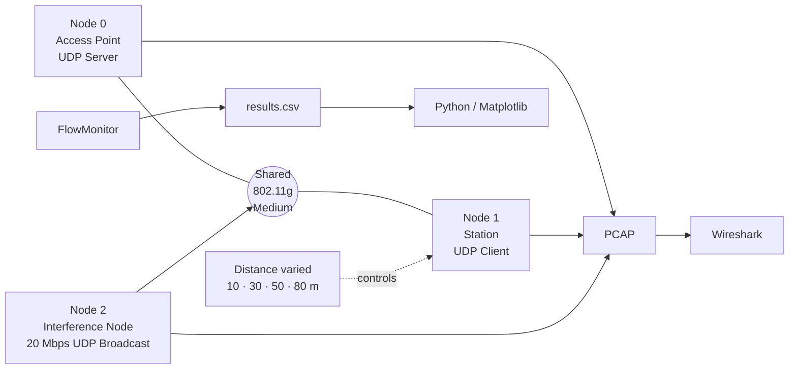

# IEEE 802.11g Jamming & Throughput Analysis — NS-3

> Evidence-based wireless-network simulation case study covering interference emulation, distance sensitivity, experiment automation, throughput analysis, and packet-level validation.

**Course:** Jaringan Nirkabel — Universitas Brawijaya  
**Project type:** Collaborative four-person Project Based Learning  
**Role:** **Group Lead / Ketua Kelompok & Wireless Network Simulation Contributor — Syifani Adillah Salsabila**  
**Simulation:** NS-3 3.38 · IEEE 802.11g · UDP · FlowMonitor  
**Analysis:** Bash · Python/Matplotlib · Wireshark · NetAnim


## Overview

This repository turns a 2025 wireless-network PBL report into a recruiter-friendly engineering case study. The project used **NS-3** to evaluate how **distance** and **high-rate interference traffic** affect IEEE 802.11g throughput in a controlled three-node topology consisting of an Access Point, a Station, and an interfering node.

The experiment combined:

- fixed-rate IEEE 802.11g (`ErpOfdmRate6Mbps`),
- UDP application traffic,
- a toggleable **20 Mbps UDP broadcast interference source**,
- repeated runs at **10, 30, 50, and 80 meters**,
- FlowMonitor-based throughput collection,
- Bash automation into CSV,
- Python/Matplotlib visualization,
- NetAnim topology validation, and
- PCAP inspection with Wireshark.

> **Terminology note:** the report sometimes uses “continuous-wave / UDP flooding jamming”. The retained implementation excerpt shows **traffic-based UDP broadcast interference**, not a physical continuous-wave RF jammer. This portfolio uses the narrower term where implementation evidence matters.

## Experimental topology



## Verified experiment configuration

| Parameter | Retained value |
|---|---|
| Simulator | NS-3 3.38 |
| Wi-Fi standard | IEEE 802.11g |
| Data/control mode | `ErpOfdmRate6Mbps` |
| Nodes | AP, STA, interference node |
| STA application packet size | 1024 B |
| STA send interval | 1000 µs |
| Interference traffic | UDP broadcast |
| Interference rate | 20 Mbps |
| Interference packet size | 1500 B |
| Distances | 10, 30, 50, 80 m |
| Conditions | interference OFF / ON |
| Metrics | tx, rx, lost, throughput |
| Validation | FlowMonitor, NetAnim, PCAP/Wireshark |

## Measured throughput

| Distance | Normal | Interference ON | Difference vs normal |
|---|---:|---:|---:|
| 10 m | **4.58 Mbps** | **2.52 Mbps** | **−45.0%** |
| 30 m | **4.58 Mbps** | **2.25 Mbps** | **−50.8%** (report value) |
| 50 m | **4.58 Mbps** | **2.25 Mbps** | **−50.8%** (report value) |
| 80 m | **0.00 Mbps** | **0.00 Mbps** | baseline connectivity already lost |

The raw retained values are mirrored in [`data/verified-results.csv`](data/verified-results.csv).

### What the results show

At **10–50 m**, the no-interference baseline stays near `4.58 Mbps`. Enabling the high-rate broadcast source cuts throughput to `2.52 Mbps` at 10 m and `2.25 Mbps` at 30–50 m.

At **80 m**, both conditions record `0 Mbps`. Because the baseline also fails, this point should be interpreted as **range/path-loss collapse in the retained experiment**, not as proof of a 100% jamming-specific degradation.

These are results from this simulation configuration, not universal claims about all 802.11g networks.

## Packet-level evidence

The report validates simulation behavior with PCAPs in Wireshark:

- the Station capture contains normal UDP traffic and 802.11 management traffic,
- the AP capture shows periodic Beacon activity and application traffic,
- the interference-node capture shows repeated UDP broadcast transmission while the interfering condition is active.

See [PACKET_ANALYSIS.md](PACKET_ANALYSIS.md) and [docs/WIRESHARK_VALIDATION.md](docs/WIRESHARK_VALIDATION.md).

## Experiment automation

The project did not rely on one manually selected run. A Bash loop executes both conditions for every retained distance and appends `RESULT,...` output into a CSV dataset.

```text
for each distance in [10, 30, 50, 80]
    run simulation with interference OFF
    collect RESULT line
    run simulation with interference ON
    collect RESULT line

results.csv → pandas/matplotlib → throughput-vs-distance graph
```

A sanitized reconstruction is available in [`examples/experiment-loop.sh`](examples/experiment-loop.sh) and [`examples/plotting-example.py`](examples/plotting-example.py).

## Evidence levels

| Claim | Evidence |
|---|---|
| NS-3 three-node AP/STA/interference topology | **Verified** |
| 802.11g constant 6 Mbps configuration | **Verified from code excerpt** |
| 20 Mbps UDP broadcast interference source | **Verified from code excerpt** |
| ON/OFF distance sweep | **Verified from automation excerpt + results** |
| 10/30/50/80 m throughput values | **Verified numerically** |
| PCAP analysis in Wireshark | **Verified by report screenshots** |
| NetAnim topology validation | **Verified by report screenshot** |
| Physical continuous-wave RF jamming | **Not implemented by retained excerpt** |
| Real-world wireless attack | **Not claimed** |
| Exact Log-Distance channel configuration | **Described in report; not explicit in retained setup excerpt** |

## Engineering judgment / consistency notes

A senior reviewer should be able to distinguish implementation from interpretation. The repository explicitly documents several report inconsistencies:

1. The report describes the AP as sending traffic to the client in one section, while the retained code excerpt installs a UDP server on the AP and a client on the STA, implying **STA → AP** application flow.
2. The narrative mentions **continuous-wave / UDP flooding jamming**, while the implementation excerpt shows **high-rate UDP broadcast traffic**.
3. The methodology discusses a **Log-Distance** propagation model, but the retained code excerpt only shows `YansWifiChannelHelper::Default()` and does not expose an explicit loss-model assignment.
4. The report labels the 80 m case as `100% (Loss)`, but because both normal and interference runs are `0 Mbps`, a jamming-specific degradation percentage is not identifiable there.

See [docs/REPORT_CONSISTENCY_NOTES.md](docs/REPORT_CONSISTENCY_NOTES.md).

## Team

| Member | Attribution |
|---|---|
| **Syifani Adillah Salsabila** | **Group Lead / Ketua Kelompok & Wireless Network Simulation Contributor** |
| Irene Noer Ramadhany | Team Member |
| Kaneysha Nadetta Julief | Team Member |
| Amanda Vania Audrey | Team Member |

Member names are retained from the final report. Syifani's **Group Lead** role is documented in this portfolio based on the project owner's confirmation. Student identification numbers are intentionally omitted.

This was collaborative coursework; this repository does **not** claim sole authorship of every original code fragment, capture, analysis step, or report section.

## Repository guide

- [Experiment design](EXPERIMENT_DESIGN.md)
- [Interference / jamming model](JAMMING_MODEL.md)
- [Results](RESULTS.md)
- [Packet analysis](PACKET_ANALYSIS.md)
- [Automation workflow](AUTOMATION.md)
- [Architecture](docs/ARCHITECTURE.md)
- [Throughput analysis](docs/THROUGHPUT_ANALYSIS.md)
- [Wireshark validation](docs/WIRESHARK_VALIDATION.md)
- [Evidence map](docs/EVIDENCE_MAP.md)
- [Reproducibility](docs/REPRODUCIBILITY.md)
- [Report consistency notes](docs/REPORT_CONSISTENCY_NOTES.md)
- [AI usage disclosure](AI_USAGE_DISCLOSURE.md)
- [Team attribution](TEAM_ATTRIBUTION.md)
- [Source evidence](SOURCE_EVIDENCE.md)
- [Limitations](LIMITATIONS.md)
- [Portfolio / CV copy](PORTFOLIO.md)

## Ethical scope

All interference experiments were performed inside a simulator. This repository does not provide instructions for disrupting real wireless networks and does not claim any over-the-air attack against third-party infrastructure.
