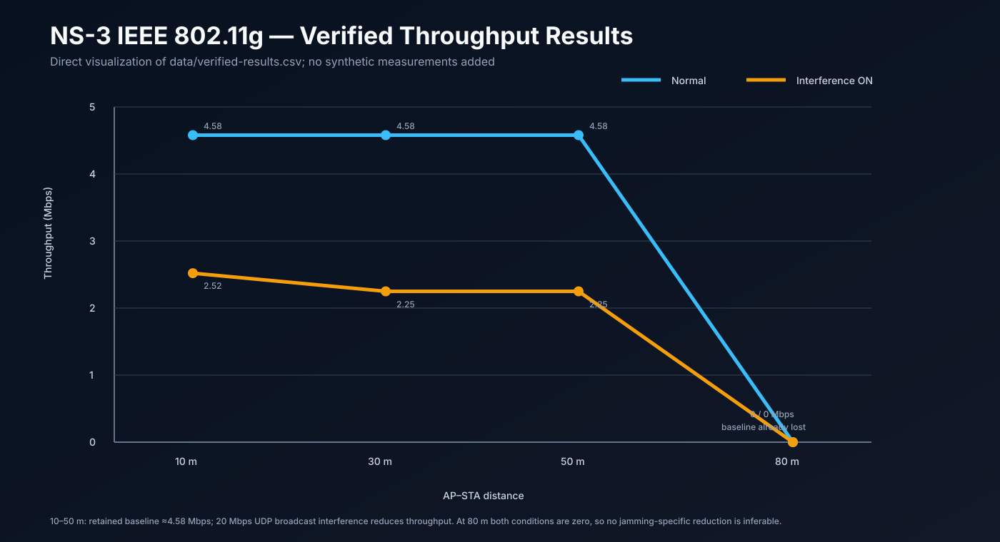
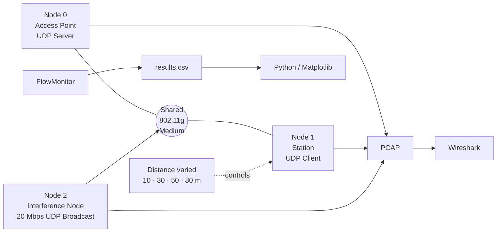

# IEEE 802.11g Jamming & Throughput Analysis — NS-3

> Evidence-based wireless-network simulation case study covering interference emulation, distance sensitivity, experiment automation, throughput analysis, and packet-level validation.

**Course:** Jaringan Nirkabel — Universitas Brawijaya  
**Project type:** Collaborative four-person Project Based Learning  
**Role:** **Group Lead / Ketua Kelompok & Wireless Network Simulation Contributor — Syifani Adillah Salsabila**  
**Simulation:** NS-3 3.38 · IEEE 802.11g · UDP · FlowMonitor  
**Analysis:** Bash · Python/Matplotlib · Wireshark · NetAnim

## Overview

This repository turns a 2025 wireless-network PBL report into a recruiter-friendly engineering case study. The project used **NS-3** to evaluate how **distance** and **high-rate interference traffic** affect IEEE 802.11g throughput in a controlled three-node topology consisting of an Access Point, a Station, and an interfering node.

The experiment combined fixed-rate IEEE 802.11g (`ErpOfdmRate6Mbps`), UDP application traffic, a toggleable **20 Mbps UDP broadcast interference source**, a 10/30/50/80 m distance sweep, FlowMonitor throughput collection, Bash automation, Python/Matplotlib analysis, NetAnim topology validation, and PCAP inspection in Wireshark.

> **Terminology note:** the retained implementation shows **traffic-based UDP broadcast interference**, not a physical continuous-wave RF jammer. This portfolio uses the narrower implementation-supported interpretation.

## Real retained result data

  

The chart above is built directly from [`data/verified-results.csv`](./data/verified-results.csv). No synthetic measurements were added.

| Distance | Normal | Interference ON | Interpretation |
|---|---:|---:|---|
| 10 m | **4.58 Mbps** | **2.52 Mbps** | ~45.0% lower throughput |
| 30 m | **4.58 Mbps** | **2.25 Mbps** | ~50.9% lower throughput |
| 50 m | **4.58 Mbps** | **2.25 Mbps** | ~50.9% lower throughput |
| 80 m | **0.00 Mbps** | **0.00 Mbps** | baseline connectivity already lost |

At 80 m, both conditions are zero. Because the baseline has already collapsed, a jamming-specific degradation percentage is **not identifiable** there.

## Senior technical review path

A reviewer can inspect the engineering story from the underlying evidence:

1. **Experiment topology & parameters:** [EXPERIMENT_DESIGN.md](./EXPERIMENT_DESIGN.md) and [docs/ARCHITECTURE.md](./docs/ARCHITECTURE.md).
2. **Interference implementation:** [JAMMING_MODEL.md](./JAMMING_MODEL.md) and [`examples/simulation-snippets.md`](./examples/simulation-snippets.md).
3. **Automation & reproducibility:** [AUTOMATION.md](./AUTOMATION.md), [`examples/experiment-loop.sh`](./examples/experiment-loop.sh), and [docs/REPRODUCIBILITY.md](./docs/REPRODUCIBILITY.md).
4. **Measured results:** [`data/verified-results.csv`](./data/verified-results.csv), [RESULTS.md](./RESULTS.md), and [docs/THROUGHPUT_ANALYSIS.md](./docs/THROUGHPUT_ANALYSIS.md).
5. **Packet-level validation:** [PACKET_ANALYSIS.md](./PACKET_ANALYSIS.md) and [docs/WIRESHARK_VALIDATION.md](./docs/WIRESHARK_VALIDATION.md).
6. **Evidence discipline:** [docs/EVIDENCE_MAP.md](./docs/EVIDENCE_MAP.md), [SOURCE_EVIDENCE.md](./SOURCE_EVIDENCE.md), [docs/REPORT_CONSISTENCY_NOTES.md](./docs/REPORT_CONSISTENCY_NOTES.md), [LIMITATIONS.md](./LIMITATIONS.md), and [AI_USAGE_DISCLOSURE.md](./AI_USAGE_DISCLOSURE.md).

## Experimental topology

## Verified experiment configuration

| Parameter | Retained value |
|---|---|
| Simulator | NS-3 3.38 |
| Wi-Fi standard | IEEE 802.11g |
| Data/control mode | `ErpOfdmRate6Mbps` |
| Nodes | AP, STA, interference node |
| STA application packet size | 1024 B |
| STA send interval | 1000 µs |
| Interference traffic | UDP broadcast |
| Interference rate | 20 Mbps |
| Interference packet size | 1500 B |
| Distances | 10, 30, 50, 80 m |
| Conditions | interference OFF / ON |
| Metrics | tx, rx, lost, throughput |
| Validation | FlowMonitor, NetAnim, PCAP/Wireshark |

## Packet-level evidence

The retained report uses PCAP/Wireshark evidence to cross-check simulation behavior:

- the Station capture contains normal UDP traffic and 802.11 management traffic;
- the AP capture shows Beacon activity and application traffic;
- the interference-node capture shows repeated UDP broadcast transmission while the interference condition is active.

This matters because the project does not rely only on the final throughput number; it also checks what traffic was actually present in the simulated medium.

## Automated result-integrity check

[`scripts/validate_results.py`](./scripts/validate_results.py) runs in GitHub Actions and protects the portfolio against accidental data drift or misleading calculations. It checks that:

- the distance sweep remains exactly `10, 30, 50, 80 m`;
- the retained normal/interference values remain consistent with the evidence dataset;
- the 10–50 m percentage reductions remain numerically consistent;
- the 80 m row explicitly preserves the fact that the baseline is also zero.

This workflow validates the **retained dataset and interpretation**, not the NS-3 runtime itself. Re-running the full experiment still requires an NS-3 environment.

## Evidence levels

| Claim | Evidence |
|---|---|
| NS-3 three-node AP/STA/interference topology | **Verified** |
| 802.11g constant 6 Mbps configuration | **Verified from retained code excerpt** |
| 20 Mbps UDP broadcast interference source | **Verified from retained code excerpt** |
| ON/OFF distance sweep | **Verified from automation + results** |
| 10/30/50/80 m throughput values | **Verified numerically** |
| PCAP analysis in Wireshark | **Verified by retained report evidence** |
| NetAnim topology validation | **Verified by retained report evidence** |
| Physical continuous-wave RF jamming | **Not implemented by retained excerpt** |
| Real-world wireless attack | **Not claimed** |
| Exact Log-Distance channel configuration | **Described in report; not explicit in retained setup excerpt** |

## Engineering judgment / consistency notes

A senior reviewer should be able to distinguish implementation from interpretation. This repository explicitly preserves several report inconsistencies instead of silently rewriting them:

1. One report section describes AP→client traffic, while the retained code excerpt installs a UDP server on the AP and a client on the STA, implying **STA→AP** application flow.
2. The report uses “continuous-wave / UDP flooding jamming,” while the implementation excerpt shows **high-rate UDP broadcast traffic**.
3. The methodology discusses a **Log-Distance** propagation model, but the retained setup excerpt does not expose an explicit loss-model assignment.
4. The 80 m result is labeled `100% (Loss)` in the report, but because both baseline and interference runs are `0 Mbps`, a jamming-specific percentage is undefined.

See [docs/REPORT_CONSISTENCY_NOTES.md](./docs/REPORT_CONSISTENCY_NOTES.md).

## Team and attribution

| Member | Attribution |
|---|---|
| **Syifani Adillah Salsabila** | **Group Lead / Ketua Kelompok & Wireless Network Simulation Contributor** |
| Irene Noer Ramadhany | Team Member |
| Kaneysha Nadetta Julief | Team Member |
| Amanda Vania Audrey | Team Member |

Member names are retained from the final report. Student identification numbers are intentionally omitted. This was collaborative coursework; the repository does **not** claim sole authorship of every original code fragment, capture, analysis step, or report section.

## Ethical scope

All interference experiments were performed inside a simulator. This repository does not provide instructions for disrupting real wireless networks and does not claim any over-the-air attack against third-party infrastructure.
