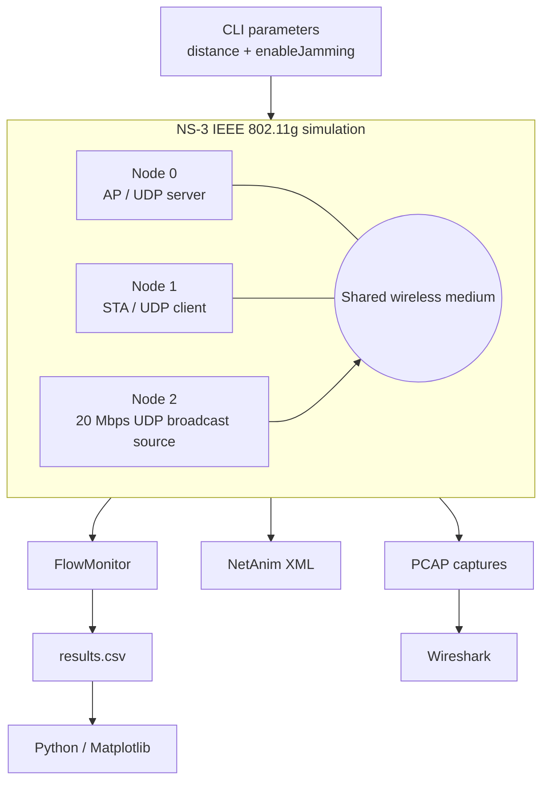

# Architecture

## Simulation architecture

## Node roles

### Node 0 — Access Point

Configured using `ApWifiMac` and shown in the retained implementation as hosting a UDP server.

### Node 1 — Station

Configured using `StaWifiMac`. Its x-coordinate is varied according to the requested distance.

### Node 2 — Interference node

Configured using `AdhocWifiMac` in the retained excerpt and placed approximately halfway between AP and STA with a 5 m y-offset. It emits high-rate UDP broadcast traffic while the interference condition is enabled.

## Data plane vs analysis plane

The project deliberately separates simulation behavior from later analysis:

- **simulation plane:** Wi-Fi, UDP application traffic, interfering traffic,
- **measurement plane:** FlowMonitor and PCAP,
- **analysis plane:** CSV, pandas/Matplotlib, Wireshark, NetAnim.

This separation makes the experiment easier to automate and reason about.
